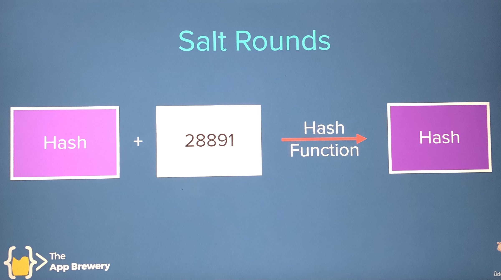

# Secrets

Deployed on [Heroku](https://boiling-tundra-41595.herokuapp.com/)

Similar to [Whisper](http://whisper.sh/), Secrets is a secret posting application.

The project demonstrates six levels of authentication and security using various [NPM](https://www.npmjs.com/) packages and OAuth 2.0 sign in with Google.

## Initial Set-up
Creates the app before any authentication/security measures implemented.

### Create package.json

```sh
$ npm init -y
```

### Install dependencies
```sh
$ npm i express ejs body-parser
```

### Startup MongoDB Server Locally
```sh
$ mongod
```

### Startup Mongo Shell Locally
```sh
$ mongo
```

## Level 1 - Username and Password
Contains a database of user accounts and stores newly created accounts using [Mongoose](https://mongoosejs.com/) and [mongoDB](https://www.mongodb.com/).

### NPM Package - Mongoose
```sh
$ npm i mongoose
```

app.js:
```
const mongoose = require("mongoose");
```

### Registration

<br/>

### Login

<br/>

### Registration or Login Success
Upon successful registration or login, the user gets redirected to a page of secrets that other users have posted anonymously.

<br/>

### MongoDB New User Added
Below is the Robo3T MongoDB GUI to help visualize the Secrets user database. The first user was registered under the email 1@2.com with a password of 123.

<br/>

Level 1 username and password creation only provides a very basic level of security as the user name and password is stored as plain text in the database.

## Level 2a - Encryption with mongoose-encryption
The user database is encrypted using [mongoose-encryption](https://www.npmjs.com/package/mongoose-encryption) where a secret string defined used to encrypt the database.

### NPM Package - mongoose-encryption
```sh
$ npm i mongoose-encryption
```

A constant secret is defined in the app.js. The [mongoose-encryption](https://www.npmjs.com/package/mongoose-encryption) package gets added as a plugin to the mongoose userSchema defined where secret is passed over as an object along with an option to only encrypt the user passwords field.

app.js:
```
const encrypt = require('mongoose-encryption');
const secret = "Thisisourlittlesecret.";
userSchema.plugin(encrypt, { secret: secret, encryptedFields: ["password"] });

```
 When a new user is created upon registration, `save` is called and their password is encrypted. Upon user login, `find` is used on the document to locate the already existing user email in the database and decrypts their password.

The second user has an email of a@b.com with a password of qwerty, however, the user's password has been encrypted and cannot be seen in the database. Whereas the first user, 1@2.com, has their password, 123, stored as just plain text since their account was created at Level 1 security where no encryption was used.

<br/>

<br/>

At its current state, if the secrets website is hacked, the app.js can be accessed where the secret string is stored and the same package, [mongoose-encryption](https://www.npmjs.com/package/mongoose-encryption), can be installed and used to decrypt the user's passwords in the database since the plain text version can be recovered.

The next layer of encryption will involve the usage of environment variables which helps store sensitive information such as encryption and API keys.

## Level 2b - Encryption Using Environment Variables
Environment variables will be loaded from a .env into `process.env` using the NPM package [dotenv](https://www.npmjs.com/package/dotenv).

### NPM Package - dotenv
```sh
$ npm i dotenv
```

At the very top of the app.js the following line of code must be added:
```
require('dotenv').config()
```
Then a .env file is created at the root directory and the environment variables must be created in the form of `NAME=VALUE` for [dotenv](https://www.npmjs.com/package/dotenv).

In this step, the secrets constant was removed from the app.js, reformatted, and placed in the .env file.

remove from app.js:

```
const secret = "Thisisourlittlesecret.";
```

place into .env:

```
SECRET=Thisisourlittlesecret.
```

**NOTE :** Any usernames, passwords and keys shown are just for demonstration purposes and are not used for the deployed app 🐱‍💻.

## Level 3 - Hashing with md5
For level 3 security, the user password will not be encrypted but instead converted into a **hash value** via a **hash function**. The password gets stored as a hash value in the database and is then compared to the hash value produced when the user tries to login using the password they registered with.

Only the user will know the plain text version of the password while the database stores a hashed version.

The [MD5](https://www.npmjs.com/package/md5) NPM package (based off the MD5 hash function) is used for this example.

### NPM Package - md5
```sh
$ npm i md5
```

app.js:
```
const md5 = require('md5');
```

#### Registration with md5
The third user is registered as user@hash.com and their password has been replaced with a hash value as seen below in the Robo3T MongoDB GUI.

<br>

#### Robo3T MongoDB GUI
The database GUI shows three registered users and how their passwords are stored in the database for Levels 1-3. Level 1 depicts basic username and password creation, Level 2 shows the password being encrypted, and Level 3 demonstrates the password being stored as a hash value in the database.

<br/>

<br/>

MD5 hashing algorithm will always produces the same hash value for a plain text password created by a user which is problematic if a database is hacked. If a hacker obtains a list of hash values associated with user accounts, hash tables (which contain hash values for commonly used plain text passwords) can be used to match the hash values and get its corresponding plain text version of the user's password that can be used to hack user's account.

<br>

Level 4 demonstrates how **salting** a hash value adds an extra layer of security.

## Level 4 - Hashing and Salting with bcrypt
Another hashing algorithm, [bcrypt](https://www.npmjs.com/package/bcrypt), can generate a random set of characters, called a **salt**, which gets added to the user's password when they create it. The salt essentially adds length to the user's password which results in a more complex hash value created by the hash function. Both the salt and hash are stored in the database in place of the user's plain text password.

A unique salt is generated for each user that creates a new account and both the salt and hash is stored in the database—So even users with the same plain text password will have different hash values. This means that even if a hacker were to gain access to a database, they won't be able to obtain the plain text versions of the passwords as easily from a hash table due to the salting.

<br>

An extra layer of security can be added by increasing the number of **salt rounds** a hash value goes through.

<br>

So once a hash is created, a salt can be added to that value to produce a new hash and then that resulting hash can be salted to produce a new hash, and so on.
<br>

After the desired number of salting rounds have been executed, the resulting hash will be stored in the database. The higher the number of rounds you decide to salt your hashes, the more secure the password, but also the longer it takes to produce the resulting hash—so more GPU computing power will be needed for more rounds 🐱‍💻!

For [bcrypt](https://www.npmjs.com/package/bcrypt) the cost for the salting rounds are displayed below. For this example, 10 rounds are sufficient.

<br>

### NPM Package - bcrypt
```sh
$ npm i bcrypt
```

app.js:
```
const bcrypt = require("bcrypt");
const saltRounds = 10;
```

The hash function gets added at the register post route and the password gets stored as the hash generated by the function:

```
bcrypt.hash(myPlaintextPassword, saltRounds, function(err, hash) {
    // Store hash in your password DB.
});
```

For the login route, the `bcrypt.compare` method will be used when verifying the password entered versus a hashed and salted version of the password stored in the database:

```
bcrypt.compare(myPlaintextPassword, hash, function(err, result) {
    // result == true
});
```
### Registration with bcrypt
The fourth user was registered with the user name of user@bcrypthash.com.
<br>

#### Robo3T MongoDB GUI
The database shows Levels 1-4 users and how their passwords are stored in the database. The fourth user's password is stored as a hash value with 10 rounds of salting.

<br>

<br>

## Level 5 - Cookies and Sessions
The type of cookies in this level are those that establish and maintain a session. A session is a period of time a browser interacts with a server. A session cookie gets created when you've logged into a website and your credentials have been authenticated. This cookie remains active during your session and allows you to navigate throughout the site without having to login and verify your credentials again. Once you logout, the session cookie gets destroyed and you can no longer freely navigate the site that requires valid user credentials without having to login again.

Implementation of cookie sessions, salting, hashing, and user authentication will be done through [passport](https://www.npmjs.com/package/passport). Passport also allows for third party user authentication through several different services such as Google, Facebook, or Twitter.

### NPM Packages - passport, passport-local, passport-local-mongoose, express-session
```sh
$ npm i passport passport-local passport-local-mongoose express-session
```

app.js:
```
const session = require("express-session");
const passport = require("passport");
const passportLocalMongoose = require("passport-local-mongoose");
```

### Establish Session in app.js
Add the session code after any `app.use` and right before `mongoose.connect`.

app.js:
```
app.use(session({
  secret: 'keyboard cat',
  resave: false,
  saveUninitialized: false
}));
```

### Initialize Passport
Right below the session code, initialize [passport](https://www.passportjs.org/docs/configure/) and use passport to set up the session.

app.js:
```
app.use(passport.initialize());
app.use(passport.session());

```
### Set-up passport-local-mongoose
Create a new mongoose schema and add [passport-local-mongoose](https://www.npmjs.com/package/passport-local-mongoose#usage) as a plugin. This will be used to hash and salt user passwords and save users into the MongoDB database.

Create the userSchema in app.js:
```
userSchema.plugin(passportLocalMongoose);
```

#### Simplified Passport/Passport-Local Configuration
A local strategy must be created to authenticate users using their username and password and is done so through a [simplified passport-local configuration](https://www.npmjs.com/package/passport-local-mongoose#simplified-passportpassport-local-configuration). Then the user will be serialized and deserialized which is necessary when using sessions. When a user is seralized, a session cookie is created which contains the user's identification. Deserialization allows passport to "open" the session cookie and uncover the identification of the user so that they may be authenticated on the server.

Create the User mongoose model in app.js:
```
passport.use(User.createStrategy());

passport.serializeUser(User.serializeUser());
passport.deserializeUser(User.deserializeUser());
```

**Note**: You may get the following `DeprecationWarning: collection.ensureIndex is deprecated. Use createIndexes instead` which is now a [resolved issue](https://github.com/Automattic/mongoose/issues/6890).

Below `mongoose.connect` add:
```
// addresses deprication warning: collection.ensureIndex is deprecated
mongoose.set('useCreateIndex', true);
```

### User Registration with passport-local-mongoose
The `register` method provided by the [passport-local-mongoose](https://www.npmjs.com/package/passport-local-mongoose) package is used to create and save a new user.

In the post method for the register route:

```
// passport-local-mongoose
User.register({
  username: req.body.username
}, req.body.password, function(err, user) {
  if (err) {
    console.log(err);
    res.redirect("/register");
  } else {
    passport.authenticate("local")(req, res, function() {
      res.redirect("/secrets");
    });
  }
});
```

#### Verify Authentication with Passport
Once a user is registered or has successfully logged in, a session cookie gets created (that the browser holds on to) which contains information about the user—namely letting the server know that the user is authenticated. The user will then be redirected to the Secrets page (listing user secrets) if their authentication is valid, else they get redirected to the login screen.

app.js:
```
// secrets route
app.get("/secrets", function(req, res) {

  // check if user is authenticated
  if (req.isAuthenticated()) {
    res.render("secrets");
  } else {
    res.redirect("/login");
  }
});
```

### Registration with passport-local-mongoose
The fifth user was registered with the user name of user@passportlocalmongoose.com.

<br>

#### Robo3T MongoDB GUI
The database shows Levels 1-5 users and how their passwords are stored in the database. The fifth user's password is stored with a hash and salt value provided by the [passport-local-mongoose](https://www.npmjs.com/package/passport-local-mongoose) package.

<br>

<br>

Now the fifth user can navigate freely throughout the website without needing to login again due to the session ID cookie being saved.

The session cookie stored for the localhost URL where the Secrets app is hosted, called connect.sid, shows it expires or gets deleted once the user exits the browser. So the user will need to login again to gain access to privileged areas.


### Login with passport
In the `post` method for the login route a new user is created.

app.js:
```
const user = new User({
  username: req.body.username,
  password: req.body.password
});
```

#### Passport Authentication
The user is authenticated using a `login()` function called on the req object provided by the [passport](https://www.passportjs.org/docs/login/) package.

Underneath new user creation in the post method for the login route in app.js:
```
// passport login authentication
req.login(user, function(err){
  if(err){
    console.log(err);
  } else {
    passport.authenticate("local")(req, res, function(){
      res.redirect("/secrets");
    });
  }
});
```

#### Deauthentication
When the user [logs out](https://www.passportjs.org/docs/logout/), they get deauthenticated, their session cookie expires and they get redirected from the secrets page back to the homepage where they can register or login.

app.js:
```
// get method for logout
app.get("/logout", function(req,res){
  req.logout();
  res.redirect("/");
});

```

## Level 6 - Google OAuth 2.0 Authentication
Open Authorization or OAuth allows users to log into third party websites such as a Google, Facebook, or Twitter so that an application can gain access to information they have on those accounts like their friends, emails or contacts for quick account set-up.

In this case, the Secrets application will delegate the task of managing passwords securely through Google. Oftentimes, it is the low tech companies that get hacked since they don't have the resources to implement all of the levels of security (hashing, salting, peppering of passwords, encryption of these databases, etc.) for authentication that the big tech companies have. So to alleviate any security liability from small companies, many turn to third party OAuth, like Google, to authenticate the user on their end by having them log into their Google account.

Using OAuth from a third party website like Google takes a few steps.

### Step 1 - Set Up Your App
The Secrets app needs to be set up in Google's developer console. Once that's completed, an app/client id will be assigned which allows the Secrets app to become the client that makes a request to Google to authenticate the user.

### Step 2 - Redirect to Authenticate
After the Secrets app setup, the app will give the user an option to login using Google.

### Step 3 - User Logs In
When a user decides to login using Google, they will be redirected a familiar and trustworthy Google login interface where they can login using their Google credentials.

### Step 4 - User Grants Permissions
Once the user logs into their Google account, this third party will then review the permissions that the Secrets app is asking for. For example, another application may want a user's profile and email address and this third party (Google) will choose whether or not to grant access to this information.

### Step 5 - Receive Authorization Code
After the third party has granted permission and the user has successfully logged into their Google account, the Secrets app will receive an authorization code from Google which allows the app to check that the user has actually successfully signed onto their Google account with their correct username and password. So the Secrets app can authenticate the user and allow them to log into the Secrets website.

### Passport Strategy - passport-google-oauth20
The [passport strategy](https://www.passportjs.org/) used is the [passport-google-oauth20](https://www.passportjs.org/packages/passport-google-oauth20/).

<br>

### NPM Package - passport-google-oauth20
```sh
$ npm install passport-google-oauth20
```

### Google Application Registration
#### Create a New Project
<br>

#### Name Project and Create
<br>

#### Google OAuth Credentials Setup
<br>

<br>

<br>

#### Adding Scopes
The Secrets app will request the user's Google email, profile, and openid for authentication.

<br>

<br>

<br>

#### Test Users
Make no changes to the default settings.
<br>

#### OAuth Client ID Creation
<br>

<br>

Authorized JavaScript origins will be the testing URL — so localhost and the next URI will be the route that when Google has authenticated the user, it will return to so they can be locally authenticated and their session cookie can be saved.

<br>

Then a OAuth client ID is created and given to be remained a secret and placed in the .env file!

<br>

In the .env file in the root directory:
<br>

### Configure Strategy
The following autheticates users with a Google account.

```
var GoogleStrategy = require('passport-google-oauth20').Strategy;

```

Add the `passport.use` method after `serialize` and `deserializing` and replacing the clientID and clientSecret with process.env.CLIENT_ID. Also replace the callbackURL with the `Authorized redirect URI` obtained when setting up the OAuth Client ID —in this case that would be `http://localhost:3000/auth/google/secrets`.

```
passport.use(new GoogleStrategy({
    clientID: process.env.CLIENT_ID
    clientSecret: process.env.CLIENT_SECRET,
    callbackURL: "http://localhost:3000/auth/google/secrets"
  },
  function(accessToken, refreshToken, profile, cb) {
    User.findOrCreate({ googleId: profile.id }, function (err, user) {
      return cb(err, user);
    });
  }
));

```

### NPM Install - mongoose-findorcreate
Install the following package [`User.findorcreate`](https://www.npmjs.com/package/mongoose-findorcreate) plugin for Mongoose that allows the method to be added into models.

```sh
$ npm install mongoose-findorcreate
```

Declare the variable `findOrCreate` then add as a plugin.
```
var findOrCreate = require("mongoose-findorcreate");
userSchema.plugin(findOrCreate);
```

### Google Login Button Path
Initiate Google authentication via the google strategy by making a get request and using the [`passport.authenticate`](https://www.passportjs.org/packages/passport-google-oauth20/#authenticate-requests) method. The client using the Google strategy then requests the user's Google profile in the scope.

```
app.get("/auth/google",
  passport.authenticate('google', {
    scope: ["profile"]
  }));

```

<br>

<br>

### Authorized Redirect URI
Google will make a get request when trying to redirect the user back to the Secrets app after logging in with Google.

The first argument in the `passport.authenticate` method will authenticate the user locally—and if there were any problems, the second argument will redirect the user back to the login page to try again. If there were no problems then the third argument uses a callback function to redirect the user to the any sort of privileged page.


```
app.get("/auth/google/secrets",
  passport.authenticate('google', { failureRedirect: '/login' }),
  function(req, res) {
    // Successful authentication, redirect home.
    res.redirect('/');
  });

```

### Serialize and Deserialize User
Replace the local authentication serialize and deserialize methods with [`passport.serializeUser`](https://www.passportjs.org/docs/configure/#sessions) and [`passport.deserializeUser`](https://www.passportjs.org/docs/configure/#sessions) methods with allow for any authentication as opposed to just local authentication.

code to replace:
```
passport.serializeUser(User.serializeUser());
passport.deserializeUser(User.deserializeUser());
```

what to replace with:
```
passport.serializeUser(function(user, done) {
  done(null, user.id);
});

passport.deserializeUser(function(id, done) {
  User.findById(id, function(err, user) {
    done(err, user);
  });
});
```

### Add googleID Field to Mongoose Schema
When a new user registers on the Secrets app, the `findOrCreate` method will be used on the database where information retrieved from the googleID field with either be saved or created if none exists.

add googleID field to mongoose schema:
```
const userSchema = new mongoose.Schema({
  email: String,
  password: String,
  googleID: String
});

```

#### Robo3T MongoDB GUI
The database shows Levels 1-6 users and how their passwords are stored in the database. However, the sixth user doesn't have any passwords stored on the Secrets app database but instead has two ids with one being the Secrets app id and the other being the their Google user id. The user's Google id will be used to authenticate them on Google's end.

<br>

### Button Styling
[Download](https://lipis.github.io/bootstrap-social/) social buttons for Bootstrap and add the bootstrap-social.css file into the public/css directory. Then link it in the header.ejs file above the custom style sheet.

```
<link rel="stylesheet" href="css/bootstrap-social.css">

<!-- custom stylesheet -->
<link rel="stylesheet" href="css/styles.css">

```

#### Add btn-social class
Add the btn-social class along with the appropriate social button—in this case `btn-google` to the anchor tags in register.ejs and login.ejs.

```
<a class="btn btn-block btn-social btn-google" href="/auth/google" role="button">
```

<br>

#### Successful Login
</br>

### Secrets Functionality
Lastly, this section shows the code required to enable users to submit secrets!

Make a get request to the page where authenticated users can submit a secret:
```
// get request for submitting a secrets
app.get("/submit", function(req, res) {

  // check if user is authenticated
  if (req.isAuthenticated()) {
    res.render("submit");
  } else {
    res.redirect("/login");
  }
});
```
</br>

Next, make a post request to allow users to post their secrets but first, another String field, `secrets` that enables passport to find the user in the database will need to be added to the `userSchema`.

```
// create new mongoose schema
const userSchema = new mongoose.Schema({
  email: String,
  password: String,
  googleId: String,
  secret: String
});
```


Post request:
```
// post request to submit secret
app.post("/submit", function(req, res) {
  const submittedSecret = req.body.secret;
  User.findById(req.user.id, function(err, foundUser){
    if(err) {
      console.log(err);
    } else {
      if(foundUser){
        foundUser.secret = submittedSecret;
        foundUser.save(function(){
          res.redirect("/secrets");
        });
      }
    }
  });
});

```
The fith user sumbitted a secret stating they don't like sticky keys as seen in the database.

</br>

</br>

#### Render User Secrets
Next, the `app.get` for the secrets route will look for all user in the database to display their secrets. `Find` will be used on the User collection on the secret field.

```
// secrets route
app.get("/secrets", function(req, res) {
  User.find({"secret": {$ne: null}}, function(err, foundUsers){
    if(err){
      console.log();
    } else {
      if(foundUsers){
        res.render("secrets", {userswithSecrets: foundUsers});
      }
    }
  });
  });
```
Now, in secrets.ejs, a `forEach` loop can be used to loop through the `userswithSecrets` array and use a callback function on each user to render the value in the `user.secrets` field into a paragraph element.

In secrets.ejs:
```
<h1 class="display-3">You've Discovered My Secret!</h1>
<p class="secret-text">Jack Bauer is my hero.</p>

<% userswithSecrets.forEach(function(user){ %>
  <p class="secret-text"><%=user.secret%></p>
<%}); %>
<hr>

```

</br>

#### MongoDB Atlas Database Cluster

</br>

## Acknowledgement
Secrets is a challenge coding project part of Dr. Angela Yu's [The Complete 2021 Web Development Bootcamp course](https://www.udemy.com/course/the-complete-web-development-bootcamp/). Thanks Dr. Yu!

